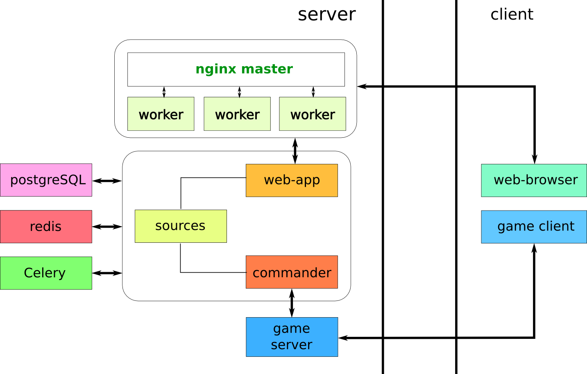

IL-2 DS Events Commander
========================

Synopsis
========

IL-2 DS Events Commander is a software system for managing events on dedicated
server of [IL-2 Sturmovik Forgotten Battles](http://en.wikipedia.org/wiki/IL-2_Sturmovik:_Forgotten_Battles) (IL-2 FB).
It is written in Python language and it is free. The main purpose of this
software is to organize different events in muptiplayer game mode and support
new features of latest game patches.

> **Note**: IL-2 FB and it's dedicated server (DS) are property of 1C and
Ubisoft. Currently they are developed by [Daidalos Team](http://forum.1cpublishing.eu/forumdisplay.php?s=fd02a019a6ba60467820fa5c8118247d&f=202)
and their updates are released and distributed as free patches. IL-2 Horus Team
does not own or distribute neither IL-2 FB nor IL-2 FB DS. You need to buy IL-2 FB
on your own to play it, however DS is distributed freely as a bunch of patches.

For end-users
=============

## Project structure overview

The project structure which used on development and staging platforms is
depicted below.

Here you can see the two parts of the entire system: server and client.

Client part consists of an IL-2 FB `game client` and a `web browser` (note:
Internet Explorer is not a browser). It's up to the user to get them both.

Server part consists of different multiple parts. The core part includes
`web application` and `commander`. They share same settings and sources and
they are grouped by a rectangle on the picture.

Commander communicates with `game server` (which is IL-2 FB DS itself) via
three channels: TCP socket for managing game flow and interaction with players,
UDP socket for getting coordinates of playesr and objects in real time and the
last: events log reader which reads and parses mission log and takes proper
actions.

Web application is ran by [`Nginx`](http://wiki.nginx.org/Main) web server in
a bunch with serveral `worker processes`. We use [uWSGI](http://uwsgi-docs.readthedocs.org/en/latest/)
as worker. More workers - more power. One worker may be just enough for you.
You may switch to any [other worker](http://nichol.as/benchmark-of-python-web-servers) or
web server, but this will not be covered here.

Both web application and comander depend on a `database` with support of
spatial data types, a quick `caching engine` and a background `tasks runner`.

We use [PostgreSQL 9.1](http://www.postgresql.org/docs/9.1/static/intro-whatis.html)
with [PostGIS 1.5](http://postgis.net/docs/manual-1.5/) as a database, but in
general you may use any other (such as MySQL) as well. We use [Redis](http://redis.io/)
as a caching engine and a shared storage between web application and commander.
[Celery](http://www.celeryproject.org/) is used for running different
background tasks.

So, the only firm project dependencies are:

* Python
* Redis
* Celery
* IL-2 DS

Among soft dependencies we name:

* PostgreSQL + PostGIS
* Ngnix + uWSGI

## Installation process

Our goal is to make commander available both for Linux and Windows families.
But currently we focus on Linux for development convenience. This section will
cover installation process for Debian-based Linux distributives such as Ubuntu.

Firstly, update your lists of available software:

    sudo apt-get update

Create postgres user:

    sudo useradd postgres

Install tools:

    sudo apt-get install curl gcc gettext git make vim unzip wget

Set your timezone (optionally):

    sudo cp /usr/share/zoneinfo/Europe/Kiev /etc/localtime

Get project sources and switch to its directory:

    git clone https://github.com/IL2HorusTeam/il2ds-events-commander.git il2ec
    cd il2ec

Install Python and create a virtual environment:

    sudo apt-get install python2.7 python2.7-dev python-pip
    sudo pip install virtualenv virtualenvwrapper
    echo "source /usr/local/bin/virtualenvwrapper.sh" >> ~/.bashrc
    source ~/.bashrc
    mkvirtualenv il2ec
    workon il2ec

Create project structure:

    VENV=$WORKON_HOME/il2ec
    mkdir $VENV/var
    mkdir $VENV/var/static
    mkdir $VENV/var/uploads
    mkdir $VENV/var/log
    touch $VENV/var/log/il2ec-web.log
    touch $VENV/var/log/il2ec-daemon.log

Install Redis:

    sudo apt-get install redis-server

Install Postgres with PostGIS, create user and database:

    sudo apt-get install postgresql-9.1 postgresql-server-dev-9.1 postgresql-9.1-postgis
    sudo su - postgres
    pg_dropcluster 9.1 --stop main
    pg_createcluster --locale=en_US.UTF-8 9.1 --port=5432 --start main

    createdb -E UTF8 template_postgis
    psql -d postgres -c "UPDATE pg_database SET datistemplate='true' WHERE datname='template_postgis';"

    psql -q -d template_postgis -f /usr/share/postgresql/9.1/contrib/postgis-1.5/postgis.sql
    psql -q -d template_postgis -f /usr/share/postgresql/9.1/contrib/postgis-1.5/spatial_ref_sys.sql

    psql -d template_postgis -c "GRANT ALL ON geometry_columns TO PUBLIC;"
    psql -d template_postgis -c "GRANT ALL ON geography_columns TO PUBLIC;"
    psql -d template_postgis -c "GRANT ALL ON spatial_ref_sys TO PUBLIC;"

    psql
    CREATE USER "YOUR_USERNAME" WITH password 'YOUR_PASSWORD' CREATEDB;
    CREATE DATABASE il2ec WITH OWNER "YOUR_USERNAME" TEMPLATE "template_postgis" ENCODING 'utf8';
    \q
    exit

Install pip dependencies:

    pip install -r requirements.pip

Next step is to configure project settings. This is a really personal thing as
it includes specifying paths to files and directories, secret keys and
passwords, etc. To make things easier, we made a mockup for production settings
which is called 'production.py' and can be found at
'il2ec/settings/production.py'. This file includes components which are shared
by all platforms and optional production componens, which you can redefine.

> **Note**: configuring project may seem a bit tricky for users not familiar
with [Django](https://www.djangoproject.com/).

So, bootstrap your production settings:

    cd il2ec/settings/components/production
    cp paths.py.example paths.py
    cp base.py.example base.py
    cd -

In `paths.py` you can define your own `VAR_ROOT` and `LOG_ROOT` variables.
'VAR_ROOT' tells where your static files fill be stored and where user files
will be uploaded. 'LOG_ROOT' tells where logs of web application and commander
will be placed.

In `base.py` you can redefine any [base settings](il2ec/settings/components/shared/base.py)
and define your own [Django settings](https://docs.djangoproject.com/en/1.6/ref/settings/).

Set your `HOSTNAME`, `PROJECT_NAME` and `SECRET_KEY`. You may generate your own
secret key by running:

    python manage.py generate_secret_key

You may define `ADMINS` and `SUPPORTERS`, who will receive emails with error
reports and emails with support requests.

Now you need to configure `DATABASES` ([docs](https://docs.djangoproject.com/en/1.6/ref/settings/#databases)).
There is an example for Postgres+PostGIS and you may just set your DB `NAME`,
`USER` name, and user `PASSWORD`.

Proceed to 'Email settings' section. It has an example for [SMTP backend](https://docs.djangoproject.com/en/1.6/topics/email/#smtp-backend)
for sending emails via Gmail account. You need to specify your onw settings.

Set your local `host` name for `IL2_CONNECTION`. This will tell commander the
ander of your network interface used by IL-2 DS.

Now you need to set `IL2_SERVER_PATH` variable which will point to the
**directory**, where your 'il2server.exe' lives.

Install [supervisor](http://supervisord.org/) and nginx:

    sudo apt-get install supervisor nginx

Install uWSGI and Celery:

    pip install uwsgi celery

Now you need to create configuration files. You can use
[some examples](https://gist.github.com/oblalex/9250092).

Firstly, create uWSGI configuration file in '/etc/uwsgi/conf.d/'
directory. You may use our staging file as example:

    sudo mkdir -p /etc/uwsgi/conf.d/
    sudo wget https://gist.githubusercontent.com/oblalex/9250092/raw/387320c1b7c338c342994e58db2650a73463ee30/il2ec-staging.ini -O /etc/uwsgi/conf.d/il2ec-production.ini
    sudo touch /tmp/uwsgi-touch-reload-il2ec

> **Note**: do not forget to edit configuration file for your needs! Specify
path to your `virtualenv`, `chdir` (path to sources), number of `workers`,
`uid` (user identifier) and `gid` (group identifier). Refer to
[the documentation](http://uwsgi-docs.readthedocs.org/en/latest/Options.html)
to see other available options.

After that it's time to define a supervisor service for running uwsgi. Again,
you can use our example file to bootstrap:

    sudo mkdir /var/log/supervisor/uwsgi
    sudo wget https://gist.githubusercontent.com/oblalex/9250092/raw/54f48dedec503a20d8eb7fd19fae7c830b7e9178/uwsgi.conf -O /etc/supervisor/conf.d/uwsgi.conf

> **Note**: change path to **uwsgi** executable file and to its **ini-config**
file (il2ec-production.ini) in `command` line. Also, change name of
**DJANGO_SETTINGS_MODULE** in `environment` line (e.g., 'il2ec.settings.production').

Create an NGINX config file for your domain to serve the web application. You
can follow [this tutorial](https://liangsun.org/posts/django-plus-uwsgi-plus-nginx/)
**or** use our example config files:

    sudo wget https://gist.githubusercontent.com/oblalex/9250092/raw/30f6601aea9ba59ca3a85153b232e626ebe60cd2/nginx.conf -O /etc/nginx/nginx.conf
    sudo wget https://gist.githubusercontent.com/oblalex/9250092/raw/0fa36fee9ee476ad5697099b30e86df6ecf00f9c/il2ec.conf -O /etc/nginx/conf.d/il2ec.conf

Then change paths to `uploads`, `static`, `favicon.ico` and `access_log` in
your `il2ec.conf`.

Create a script for running Celery (you do not have to change it):

    sudo mkdir /var/log/celery
    sudo mkdir /var/run/celery
    sudo wget https://gist.githubusercontent.com/oblalex/9250092/raw/3734861ca1c0ce06e6b2d49a7510b66def1d794f/celeryd -O /etc/init.d/celeryd

Get Celery configuration example:

    sudo wget https://gist.githubusercontent.com/oblalex/9250092/raw/e3b4169c3d1b5bcf5b44510794204341df05a218/celery-defaults -O /etc/default/celeryd

Enable Celery to run at start up:

    sudo chmod +x /etc/init.d/celeryd
    sudo chown root:root /etc/init.d/celeryd

    sudo update-rc.d celeryd defaults
    sudo update-rc.d celeryd enable

Change `ENV_PYTHON`, `CELERYD_CHDIR`, `CELERYD_USER`, `CELERYD_GROUP` and
`DJANGO_SETTINGS_MODULE` for your needs.

## Starting system

DB, uWSGI and Nginix will start automatically when the system boots. You just
need to start your IL2 DS. To start commander, run:

    workon il2ec
    python manage.py run_commander --settings=il2ec.settings.production

For developers
==============

## Development process overview

Development of this project is a fully isolated process. All services and
servers (except game server) are running on a VirtualBox guest machine. It is
managed by [Vagrant](http://www.vagrantup.com/) and provisioned by
[Puppet](http://puppetlabs.com/puppet/what-is-puppet). You do not need to dive
into the abyss of knowledge about how these things are working. If you are not
familiar with DevOps, just let the magic happen to you: run few commands and
look how the entire system borns and gets configured automatically. You can
access the guest machine via SSH or use [Fabric](http://docs.fabfile.org/en/1.8/)
to run some commands.

During provisioning you will get installed and configured Postgres 9.1, PostGIS 1.5,
Redis, Nginx+uWSGI, isolated Python environment (by [virtualenv](http://www.virtualenv.org/en/latest/)),
configured project and other stuff. Due to certain problems with running
IL-2 Dedicated Server on VirtualBox under Wine, IL-2 DS must be located on the
host machine.

The approach, described above, provides identical development environment for
every developer. This environment is close to the real production server
environment, so minimal amount of deployment issues is expected.

## Creating new local environment

To start development on this project, you will need:

1. Install needed software.
2. Clone git repository.
3. Setup security settings.
4. Get IL-2 DS somewhere and place it to project's directory. In case
you've got no one, maybe this [full and clean 4.12.2](https://drive.google.com/file/d/0B4hbTGD5PQqQOUtBVTJqWEFhaU0/edit?usp=sharing) will help you (Its size is ~2 GB, so take some patience).
Or you can leave this task up to automatic provisioning stage.
5. Start VM and automatically provision all needed stuff. This will start
the web application.
6. Update 'hosts' file.
7. Start IL-2 DS.
8. Run commander.

### Install tools

1. git
2. vagrant (>=1.3)
3. virtualbox (>=4.0)
4. NFS server
5. fabric
6. wine (>=1.6) # to develop work on Linux only

If you need to run project on guest FreeBSD or Windows then copy propper
vagrant boxes to `provision/boxes` (see Vagrantfile for names).

### Get sourses

Clone the whole project:

    git clone --recursive git@github.com:IL2HorusTeam/il2ds-events-commander.git

### Setup private settings

You will need to use an existsing development email for different purposes:
sending email confirmation requests, password resetting requests, etc. To make
this possible, you need to copy `il2ec/settings/local/private.py.example`
into `il2ec/settings/local/private.py` and set valid value for
`EMAIL_HOST_PASSWORD`. Contact developers to get the real passsword value.

### Get IL-2 DS

**Copy** IL-2 DS directory to `provision/files/il2ds` so that executable file
will be accessible as `provision/files/il2ds/il2server.exe`. You need to do
this to provide access to config and log files from virtual machine directly. Do
not mind if you have no local copy of IL-2 DS: it will be obtained during
provisioning and placed to the directory as mentioned just above.

> **Note**: `confs.ini`, `gc.cmd` and `server.cmd` will be changed during
development. Their content will be taken from `provision/files/conf/il2ds`.
Place all your custom server commands to `user.cmd` inside server root
directory.

### Start VM and let some magic happen

Start a development virtual machine:

    vagrant up [ubuntu|freebsd|windows]
    fab incarnate

This will bring for you a clean virtual machine, install all of the necessary
software and configure it, create database and run several services, so the web
application will be accessible at

    http://localhost:8010

### Update 'hosts'

To make your IL-2 server accessible from the outer world, you need to set
a `localHost` parameter in server's config file. This parameter specifies an IP
address of the network interface the server will be running on. Due to bugs
occurring on Wine running on VirtualBox, it was decided to place IL-2 server
outside the virtual machine. Hence, the value of `localHost` may vary for every
developer while it must be stored in repository and remain the same. To resolve
this problem it was decided to store the name of server's interface as
`il2ds-host`. It's value must be specified on developer's machine and on the
virtual machine. To do that you need to edit `hosts` file on both of them.
To define `il2ds-host` on Windows host machine, add the next string to your
`C:\Windows\System32\Drivers\etc\hosts`:

    XXX.XXX.XXX.XXX    il2ds-host

where `XXX.XXX.XXX.XXX` is the IP address of target network interface.
For the Linux host machine run:

    sudo bash -c 'echo "XXX.XXX.XXX.XXX    il2ds-host" >> /etc/hosts'

Run this command on the guest machine also (for any host machine):

    vagrant ssh
    sudo bash -c 'echo "XXX.XXX.XXX.XXX    il2ds-host" >> /etc/hosts'
    exit

### Run game server

Then you can start your dedicated server: on Windows run `il2server.exe` as
usual. On Linux you can run it as:

    wine PATH/TO/PROJECT/provision/files/il2ds/il2server.exe &

To make your work with dedicated server on Linux easier, you can install
[il2dsd](https://github.com/IL2HorusTeam/il2dsd). If so, set path to your
`il2server.exe` in `/etc/il2dsd.conf` and start the service:

    sudo service il2dsd start

### Run commander

Execute next command to run commander as daemon:

    fab commander:run

## Starting existing local environment

To start existing provisioned environment, simply run:

    vagrant up
    fab reload_all

## Configuring staging environment

Staging platform is a remote machine, where the project runs on the real
hardware.

Create `il2ec-dev` user and `il2ec-dev` group on your staging machine. To allow
user to use 'sudo' without password:

    sudo bash -c 'echo "il2ec-dev ALL=(ALL) NOPASSWD: ALL" >> /etc/sudoers.d/il2ec'

Install SSH server:

    sudo apt-get install openssh-server

Now, follow installation process guide for end-users. Remember, your settings
name is `staging`.

After that you can come back to your local machine.

To access remote machine without any authentication pain, you need to create an
SSH key:

    ssh-keygen -t rsa -b 4096

Enter `./ssh/staging_key` as a file name, and then keep hitting return
without input for passwords. Now, append the contents of local
`./ssh/staging_key.pub` file to `~/.ssh/authorized_keys` on the remote machine.

Add `il2ec-staging` address to `/etc/hosts` on your local machine.

To totally reset project on remote machine with DB flush, run:

    fab staging reset

To update project on remote machine, run:

    fab staging update

